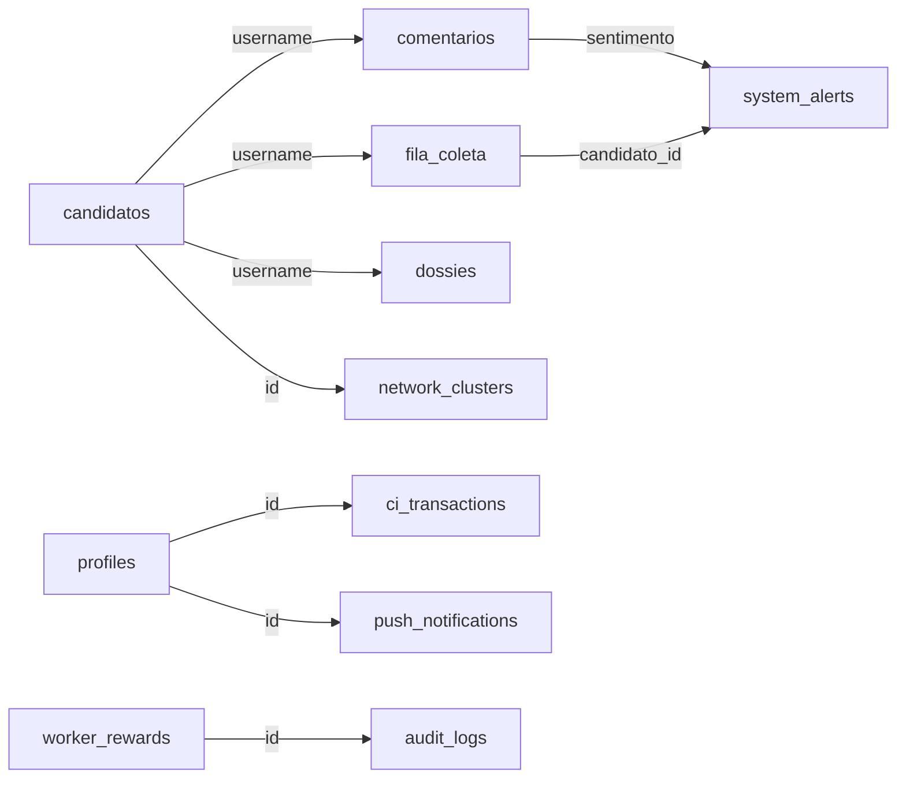

# Database Schema — Sentinela v88.0

**Última Atualização**: 2026-06-04  
**Versão do Schema**: v88.0 (Fase 8.3)  
**Banco**: Supabase (PostgreSQL)

---

## 📋 Visão Geral

O banco de dados da Sentinela é organizado em **5 domínios principais**:

| Domínio | Descrição | Tabelas Principais |
|---------|-----------|-------------------|
| **Monitoramento** | Candidatos e coleta de dados | `candidatos`, `fila_coleta`, `comentarios` |
| **Inteligência** | Análise e classificação | `dossies`, `network_clusters`, `sentimentos` |
| **Alertas** | Notificações e monitoramento | `system_alerts`, `profiles`, `push_notifications` |
| **Financeiro** | Créditos internos (CI) | `ci_transactions`, `profiles` |
| **Admin** | Configuração e auditoria | `audit_logs`, `kpis`, `worker_rewards` |

---

## 🗂️ Tabelas por Domínio

### Domínio 1: Monitoramento

#### `candidatos` — Base de Dados de Perfis Monitorados

**Descrição**: Armazena todos os perfis de Instagram em monitoramento.

**Columns**:
```sql
CREATE TABLE candidatos (
  id UUID PRIMARY KEY DEFAULT gen_random_uuid(),
  username TEXT UNIQUE NOT NULL,              -- Ex: "lula", "bolsonaro"
  
  -- Dados Sociais
  plataforma TEXT DEFAULT 'instagram',        -- Ex: "instagram", "twitter", "youtube"
  seguidores INT DEFAULT 0,                   -- Contagem de seguidores
  perfil_verificado BOOLEAN DEFAULT FALSE,
  
  -- Classificação Política
  cargo TEXT,                                 -- Ex: "Presidente", "Deputado"
  estado TEXT,                                -- Ex: "SP", "RJ"
  partido TEXT,                               -- Ex: "PT", "PSDB"
  
  -- Temperatura de Monitoramento (PASA v85.6)
  termometro ENUM('QUENTE', 'MORNO', 'FRIO') DEFAULT 'MORNO',
  
  -- Frequência de Posts
  posts_frequencia_semanal FLOAT DEFAULT 0.0, -- Posts por semana
  
  -- Última Coleta
  last_scraped_at TIMESTAMP,                  -- Última raspagem
  
  -- Integridade
  shadowban_suspect BOOLEAN DEFAULT FALSE,    -- Possível shadowban
  status_monitoramento ENUM('Ativo', 'Inativo', 'Pausado') DEFAULT 'Ativo',
  
  -- Metadata
  created_at TIMESTAMP DEFAULT NOW(),
  updated_at TIMESTAMP DEFAULT NOW()
);
```

**Índices**:
```sql
CREATE INDEX idx_candidatos_username ON candidatos(username);
CREATE INDEX idx_candidatos_status ON candidatos(status_monitoramento);
CREATE INDEX idx_candidatos_termometro ON candidatos(termometro);
```

**Exemplo**:
```json
{
  "id": "550e8400-e29b-41d4-a716-446655440000",
  "username": "lula",
  "plataforma": "instagram",
  "seguidores": 18500000,
  "partido": "PT",
  "termometro": "QUENTE",
  "posts_frequencia_semanal": 4.2,
  "last_scraped_at": "2026-06-04T10:30:00Z"
}
```

---

#### `fila_coleta` — Fila de Prioridade de Coleta

**Descrição**: Gerencia a fila de trabalho com sistema de prioridades e locks atômicos.

**Columns**:
```sql
CREATE TABLE fila_coleta (
  id UUID PRIMARY KEY DEFAULT gen_random_uuid(),
  
  -- Referência ao Candidato
  candidato_id TEXT NOT NULL,                 -- FK para candidatos.username
  
  -- Prioridade (PASA v55.1)
  prioridade INT DEFAULT 3,                   -- 1=MÁXIMA, 5=MÍNIMA
  
  -- Status de Processamento
  status ENUM(
    'PENDENTE',           -- Aguardando processamento
    'EM_CURSO',          -- Sendo processado
    'CONCLUIDO',         -- Completado com sucesso
    'FALHA',             -- Erro no processamento
    'SEM_DADOS_RECENTES' -- Nenhum dado novo encontrado
  ) DEFAULT 'PENDENTE',
  
  -- Distributed Locking (PASA v88.0)
  locked_by TEXT,                             -- Worker ID que está processando
  locked_at TIMESTAMP,                        -- Quando foi feito o lock
  
  -- Scheduling
  data_agendada TIMESTAMP,                    -- Quando processar (opcional)
  
  -- Auditoria
  created_at TIMESTAMP DEFAULT NOW(),
  updated_at TIMESTAMP DEFAULT NOW(),
  
  -- Constraints
  UNIQUE(candidato_id, data_agendada)
);
```

**Índices**:
```sql
CREATE INDEX idx_fila_status ON fila_coleta(status);
CREATE INDEX idx_fila_prioridade ON fila_coleta(prioridade, status);
CREATE INDEX idx_fila_locked_by ON fila_coleta(locked_by);
```

**Exemplo**:
```json
{
  "id": "550e8400-e29b-41d4-a716-446655440001",
  "candidato_id": "bolsonaro",
  "prioridade": 1,
  "status": "EM_CURSO",
  "locked_by": "scraper-worker-1",
  "locked_at": "2026-06-04T12:00:00Z"
}
```

---

#### `comentarios` — Repositório de Comentários Coletados

**Descrição**: Armazena todos os comentários capturados do Instagram.

**Columns**:
```sql
CREATE TABLE comentarios (
  id UUID PRIMARY KEY DEFAULT gen_random_uuid(),
  
  -- Referência ao Candidato
  candidato_id TEXT NOT NULL,                 -- FK para candidatos.username
  
  -- Identificador Externo (Idempotência)
  id_externo TEXT NOT NULL UNIQUE,            -- ID nativo do Instagram
  
  -- Dados do Comentário
  autor_username TEXT,                        -- Quem fez o comentário
  texto_bruto TEXT,                           -- Conteúdo original
  texto_normalizado TEXT,                     -- Texto cleaned (saneamento_lexical)
  
  -- Classificação de Sentimento (MCA v2.2)
  sentimento ENUM(
    'POSITIVO',
    'NEGATIVO',
    'NEUTRO'
  ) DEFAULT NULL,
  
  confianca FLOAT DEFAULT 0.0,                -- Score 0.0-1.0
  categorias TEXT[],                          -- MCA v2.2 categories (JSON array)
  
  -- Flags de Qualidade
  is_hate BOOLEAN DEFAULT FALSE,              -- Detectado como hate speech
  is_spam BOOLEAN DEFAULT FALSE,              -- Detectado como spam
  
  -- Auditoria Analítica (AuditAgent)
  audit_discrepancy BOOLEAN DEFAULT FALSE,    -- Divergência detectada entre classificadores
  audit_data JSONB,                           -- JSON de reclassificação do auditor (Groq)
  needs_review BOOLEAN DEFAULT FALSE,         -- Marcador para revisão humana
  
  -- Rasping Info
  data_comentario TIMESTAMP,                  -- Quando foi postado
  data_coleta TIMESTAMP DEFAULT NOW(),        -- Quando foi coletado
  plataforma TEXT DEFAULT 'instagram',
  
  -- Auditoria
  created_at TIMESTAMP DEFAULT NOW(),
  updated_at TIMESTAMP DEFAULT NOW()
);
```

**Índices**:
```sql
CREATE INDEX idx_comentarios_candidato ON comentarios(candidato_id);
CREATE INDEX idx_comentarios_sentimento ON comentarios(sentimento);
CREATE INDEX idx_comentarios_id_externo ON comentarios(id_externo);
```

**Exemplo**:
```json
{
  "id": "550e8400-e29b-41d4-a716-446655440002",
  "candidato_id": "lula",
  "id_externo": "ig_17923748293874",
  "autor_username": "user123",
  "texto_bruto": "Que discurso incrível!",
  "sentimento": "POSITIVO",
  "confianca": 0.92,
  "data_comentario": "2026-06-03T14:22:00Z"
}
```

---

### Domínio 2: Inteligência

#### `dossies` — Dossiês PDF Gerados

**Descrição**: Armazena metadados de dossiês PDF gerados para cada candidato.

**Columns**:
```sql
CREATE TABLE dossies (
  id UUID PRIMARY KEY DEFAULT gen_random_uuid(),
  
  -- Referência
  candidato_id TEXT NOT NULL UNIQUE,          -- FK para candidatos.username
  
  -- Arquivo
  arquivo_url TEXT,                           -- Link para PDF no storage
  arquivo_hash TEXT,                          -- Hash para validação
  tamanho_bytes INT,
  
  -- Conteúdo
  titulo TEXT,                                -- "Dossiê de [Candidato]"
  data_geracao TIMESTAMP DEFAULT NOW(),
  data_atualizacao TIMESTAMP,
  
  -- Configuração
  schema_versao INT DEFAULT 1,                -- Versão do schema de PDF
  incluir_sentimentos BOOLEAN DEFAULT TRUE,
  incluir_timeline BOOLEAN DEFAULT TRUE,
  incluir_network BOOLEAN DEFAULT FALSE,
  
  -- Auditoria
  gerado_por TEXT,                            -- Worker ID ou usuário
  created_at TIMESTAMP DEFAULT NOW()
);
```

**Índices**:
```sql
CREATE INDEX idx_dossies_candidato ON dossies(candidato_id);
```

---

#### `network_clusters` — Clusters de Análise de Rede

**Descrição**: Armazena clusters detectados pelo NetworkMinerWorker.

**Columns**:
```sql
CREATE TABLE network_clusters (
  id UUID PRIMARY KEY DEFAULT gen_random_uuid(),
  
  -- Identificação
  cluster_id TEXT NOT NULL UNIQUE,            -- Ex: "cluster_001_pt_network"
  nome TEXT,
  tipo ENUM('PARTIDO', 'INFLUENCER_NETWORK', 'BOT_RING', 'COORDINATED_BEHAVIOR'),
  
  -- Conteúdo
  nodos TEXT[],                               -- Array de usernames nos cluster
  arestas JSONB,                              -- Grafo de relacionamentos
  
  -- Força do Cluster
  coesao_score FLOAT,                         -- 0.0-1.0
  tamanho INT,                                -- Número de nodos
  
  -- Temporal
  data_deteccao TIMESTAMP DEFAULT NOW(),
  data_atualizacao TIMESTAMP,
  
  -- Análise
  sentimento_medio ENUM('POSITIVO', 'NEGATIVO', 'NEUTRO'),
  atividade_recente BOOLEAN
);
```

---

### Domínio 3: Alertas

#### `system_alerts` — Alertas do Sistema

**Descrição**: Armazena alertas de anomalia e risco.

**Columns**:
```sql
CREATE TABLE system_alerts (
  id UUID PRIMARY KEY DEFAULT gen_random_uuid(),
  
  -- Tipo de Alerta
  tipo ENUM(
    'ANOMALIA_COMPORTAMENTO',
    'SPIKE_SENTIMENTO',
    'DETECTADO_COORDENACAO',
    'RISCO_FALHA_SISTEMA',
    'LIMITE_CI_ATINGIDO',
    'WORKER_CRASH'
  ),
  
  -- Alvo
  candidato_id TEXT,                          -- FK para candidatos.username
  worker_id TEXT,                             -- Se alerta relacionado a worker
  
  -- Dados do Alerta
  titulo TEXT,
  descricao TEXT,
  severidade ENUM('CRÍTICO', 'ALTO', 'MÉDIO', 'BAIXO'),
  
  -- Status
  status ENUM('NOVO', 'ANALISADO', 'RESOLVIDO', 'DESCARTADO') DEFAULT 'NOVO',
  
  -- Notificações
  enviado_fcm BOOLEAN DEFAULT FALSE,
  enviado_webhook BOOLEAN DEFAULT FALSE,
  
  -- Auditoria
  created_at TIMESTAMP DEFAULT NOW(),
  resolvido_em TIMESTAMP
);
```

**Índices**:
```sql
CREATE INDEX idx_system_alerts_status ON system_alerts(status);
CREATE INDEX idx_system_alerts_severidade ON system_alerts(severidade);
```

---

#### `profiles` — Perfis de Usuários Admin

**Descrição**: Usuários admins com controle de CI (créditos internos).

**Columns**:
```sql
CREATE TABLE profiles (
  id UUID PRIMARY KEY,                        -- FK para auth.users
  
  -- Identificação
  email TEXT UNIQUE,
  nome_completo TEXT,
  
  -- Permissões
  is_admin BOOLEAN DEFAULT FALSE,
  role ENUM('VIEWER', 'ANALYST', 'ADMIN', 'SUPER_ADMIN'),
  
  -- CI (Créditos Internos)
  saldo_ci INT DEFAULT 100,                   -- Créditos para operações
  ci_limite_mensal INT DEFAULT 1000,
  ci_usado_mes_atual INT DEFAULT 0,
  
  -- Auditoria
  created_at TIMESTAMP DEFAULT NOW(),
  updated_at TIMESTAMP DEFAULT NOW()
);
```

---

#### `push_notifications` — Registro de Notificações FCM

**Descrição**: Log de push notifications enviadas.

**Columns**:
```sql
CREATE TABLE push_notifications (
  id UUID PRIMARY KEY DEFAULT gen_random_uuid(),
  
  -- Destinatário
  profile_id UUID NOT NULL,                   -- FK para profiles.id
  
  -- Conteúdo
  titulo TEXT,
  corpo TEXT,
  tipo_alerta TEXT,
  
  -- Status
  enviado_em TIMESTAMP DEFAULT NOW(),
  entregue BOOLEAN DEFAULT FALSE,
  entregue_em TIMESTAMP,
  
  -- Tracking
  clicado BOOLEAN DEFAULT FALSE,
  clicado_em TIMESTAMP
);
```

---

### Domínio 4: Financeiro

#### `ci_transactions` — Transações de Créditos Internos

**Descrição**: Log completo de movimentação de CI (moeda interna).

**Columns**:
```sql
CREATE TABLE ci_transactions (
  id UUID PRIMARY KEY DEFAULT gen_random_uuid(),
  
  -- Contas
  de_profile_id UUID,                         -- Quem enviou
  para_profile_id UUID,                       -- Quem recebeu
  
  -- Transação
  quantidade INT NOT NULL,
  tipo ENUM(
    'OPERACAO_COLETA',      -- Scraping
    'OPERACAO_CLASSIFICACAO', -- AI
    'OPERACAO_PDF',          -- Dossier
    'PENALIDADE',            -- Penalidade por erro
    'BONUS_PERFORMANCE',     -- Bônus
    'TRANSFERENCIA'          -- Manual
  ),
  
  -- Descrição
  descricao TEXT,
  
  -- Auditoria
  referencia_id TEXT,                         -- Ex: task_id, worker_id
  created_at TIMESTAMP DEFAULT NOW()
);
```

**Índices**:
```sql
CREATE INDEX idx_ci_transactions_profile ON ci_transactions(de_profile_id, para_profile_id);
```

---

### Domínio 5: Admin & Auditoria

#### `audit_logs` — Log de Auditoria

**Descrição**: Rastreamento completo de ações no sistema.

**Columns**:
```sql
CREATE TABLE audit_logs (
  id UUID PRIMARY KEY DEFAULT gen_random_uuid(),
  
  -- Ator
  user_id UUID,                               -- Quem fez
  user_email TEXT,
  
  -- Ação
  acao TEXT,                                  -- Ex: "RECLASSIFY", "DELETE_TARGET"
  tabela_afetada TEXT,                        -- Qual tabela
  registro_id TEXT,                           -- Qual registro
  
  -- Dados
  valores_antigos JSONB,                      -- Estado anterior
  valores_novos JSONB,                        -- Estado novo
  
  -- Resultado
  sucesso BOOLEAN,
  mensagem_erro TEXT,
  
  -- Temporal
  created_at TIMESTAMP DEFAULT NOW(),
  ip_address INET,
  user_agent TEXT
);
```

---

#### `kpis` — Métricas Chave do Sistema

**Descrição**: Snapshot diário/horário de KPIs.

**Columns**:
```sql
CREATE TABLE kpis (
  id UUID PRIMARY KEY DEFAULT gen_random_uuid(),
  
  -- Timestamp
  period_start TIMESTAMP NOT NULL,
  period_end TIMESTAMP NOT NULL,
  period_type ENUM('HORA', 'DIA', 'SEMANA', 'MES'),
  
  -- Métricas
  total_candidatos INT,
  total_comentarios INT,
  total_classificacoes INT,
  
  -- Financeiro
  monthly_revenue DECIMAL(10, 2),
  burn_rate DECIMAL(10, 2),
  
  -- Performance
  avg_classification_confidence FLOAT,
  scraper_uptime_percent FLOAT,
  workers_active INT,
  
  -- Inteligência
  clusters_detected INT,
  anomalies_detected INT,
  
  -- Auditoria
  created_at TIMESTAMP DEFAULT NOW()
);
```

---

#### `worker_rewards` — Sistema de Reputação de Workers

**Descrição**: Score e badges de desempenho para workers.

**Columns**:
```sql
CREATE TABLE worker_rewards (
  id UUID PRIMARY KEY DEFAULT gen_random_uuid(),
  
  -- Worker
  worker_id TEXT NOT NULL UNIQUE,             -- Ex: "scraper-worker-1"
  
  -- Performance
  ciclos_completados INT DEFAULT 0,
  ciclos_falhados INT DEFAULT 0,
  tempo_medio_ciclo FLOAT,                    -- Segundos
  
  -- Score (PASA v88.0)
  score DECIMAL(5, 2) DEFAULT 50.0,           -- 0.0-100.0
  tier ENUM(
    'PLATINUM',                               -- Score >= 90
    'GOLD',                                   -- Score >= 75
    'SILVER',                                 -- Score >= 50
    'BRONZE',                                 -- Score >= 25
    'CRITICAL'                                -- Score < 25
  ) DEFAULT 'BRONZE',
  
  -- Badges
  badges TEXT[],                              -- Ex: ["first_blood", "speedrun"]
  
  -- Temporal
  ultimo_ciclo TIMESTAMP,
  created_at TIMESTAMP DEFAULT NOW(),
  updated_at TIMESTAMP DEFAULT NOW()
);
```

---

#### `worker_suggestions` — Diagnósticos de AI Advisor

**Descrição**: Sugestões de melhoria geradas pelo AIAdvisor.

**Columns**:
```sql
CREATE TABLE worker_suggestions (
  id UUID PRIMARY KEY DEFAULT gen_random_uuid(),
  
  -- Alvo
  worker_id TEXT NOT NULL,                    -- Qual worker
  
  -- Sugestão
  titulo TEXT,
  descricao TEXT,
  tipo ENUM('PERFORMANCE', 'RELIABILITY', 'COST_OPTIMIZATION'),
  
  -- Status
  status ENUM('PENDING_REVIEW', 'APPLIED', 'REJECTED', 'ARCHIVED') DEFAULT 'PENDING_REVIEW',
  
  -- Impacto Estimado
  impacto_score FLOAT,                        -- 0.0-1.0
  
  -- Auditoria
  proposto_em TIMESTAMP DEFAULT NOW(),
  resolvido_em TIMESTAMP,
  resolvido_por TEXT                          -- User ID
);
```

---

## 🔐 Row Level Security (RLS)

### Policies Principais

```sql
-- Profiles: Usuários veem apenas seu próprio perfil
ALTER POLICY "Users can read their own profile"
  ON profiles USING (auth.uid() = id);

-- CI Transactions: Apenas admins veem todas
ALTER POLICY "Admins can read all transactions"
  ON ci_transactions
  USING (auth.claims() -> 'role' = 'admin');

-- Candidatos: Públicos (leitura), apenas admin escreve
ALTER POLICY "Candidatos readable by all"
  ON candidatos FOR SELECT USING (true);

ALTER POLICY "Candidatos writable by admin"
  ON candidatos FOR UPDATE USING (auth.claims() -> 'role' = 'admin');
```

---

## 📊 Relacionamentos Principais



---

## 🔄 Fluxo de Dados Típico

```
1. CANDIDATO ADICIONADO
   ↓ candidatos INSERT
   ↓ fila_coleta INSERT (PENDENTE)

2. SCRAPING
   ↓ fila_coleta UPDATE (EM_CURSO → locked_by)
   ↓ comentarios INSERT
   ↓ fila_coleta UPDATE (CONCLUIDO)

3. CLASSIFICAÇÃO
   ↓ comentarios UPDATE (sentimento)
   ↓ kpis UPDATE (total_classificacoes++)

4. ANÁLISE
   ↓ network_clusters INSERT/UPDATE
   ↓ system_alerts INSERT (se anomalia)

5. NOTIFICAÇÃO
   ↓ push_notifications INSERT
   ↓ profiles UPDATE (saldo_ci--)
   ↓ ci_transactions INSERT
```

---

## 📈 Performance

### Estratégia de Índices

| Tabela | Índices | Razão |
|--------|---------|-------|
| `candidatos` | username, status, termometro | Busca frequente |
| `comentarios` | candidato_id, sentimento | Filtros comuns |
| `fila_coleta` | status, prioridade | Queue operations |
| `ci_transactions` | profile_ids, data | Análise de despesa |

### Query Típicas Otimizadas

```sql
-- Próximo alvo a processar
SELECT * FROM fila_coleta
WHERE status = 'PENDENTE' AND prioridade <= 5
ORDER BY prioridade ASC, created_at ASC
LIMIT 1
FOR UPDATE SKIP LOCKED;

-- Comentários não classificados
SELECT COUNT(*) FROM comentarios
WHERE candidato_id = 'lula' AND sentimento IS NULL;

-- Saldo CI de user
SELECT saldo_ci FROM profiles WHERE id = $1;

-- Clusters por candidato
SELECT * FROM network_clusters
WHERE nodos @> ARRAY[$1]
ORDER BY data_deteccao DESC;
```

---

## 🔑 Constraints & Validação

```sql
-- Fila: Não duplica pendente para mesmo candidato
ALTER TABLE fila_coleta
  ADD CONSTRAINT fila_coleta_no_duplicate_pending
  UNIQUE (candidato_id, data_agendada);

-- CI: Saldo nunca negativo
ALTER TABLE profiles
  ADD CONSTRAINT profiles_saldo_ci_positive CHECK (saldo_ci >= 0);

-- Comentário: ID externo único (idempotência)
ALTER TABLE comentarios
  ADD CONSTRAINT comentarios_id_externo_unique UNIQUE (id_externo);

-- Score: Entre 0 e 100
ALTER TABLE worker_rewards
  ADD CONSTRAINT worker_rewards_score_range CHECK (score >= 0 AND score <= 100);
```

---

## 📋 Migrations Aplicadas

| Versão | Data | Descrição |
|--------|------|-----------|
| v19.6 | 2026-04-15 | Base schema |
| v20.0 | 2026-04-20 | Tabela `anuncios` |
| v21.0 | 2026-04-25 | Push tokens |
| v22.0 | 2026-05-01 | Scraping accounts |
| v23.0 | 2026-05-10 | Tabela `dossies` |
| v24.0 | 2026-05-15 | Sistema de alertas |
| v25.0 | 2026-05-20 | Multi-tenancy |
| v26.0 | 2026-05-25 | Motor de alvos (queue) |
| v28.0 | 2026-05-30 | CI Governance, Mining Flags |
| v88.0 | 2026-06-04 | Atomic locks, PASA v88 |

---

## ✅ Checklist de Configuração

- [ ] Todas as migrations aplicadas no Supabase
- [ ] Índices criados para performance
- [ ] RLS policies ativadas
- [ ] Backups diários configurados
- [ ] Realtime subscriptions testadas
- [ ] Full-text search ativado (se usar)

---

## 📞 Documentação Relacionada

- `docs/core/QUEUE_MANAGER.md` — Detalhes de `fila_coleta`
- `docs/core/AI_SERVICE.md` — Lógica de classificação de sentimentos
- `docs/workers/ALERT_WORKER.md` — Geração de alertas
- `docs/ENVIRONMENT_VARIABLES.md` — Conexão ao Supabase

