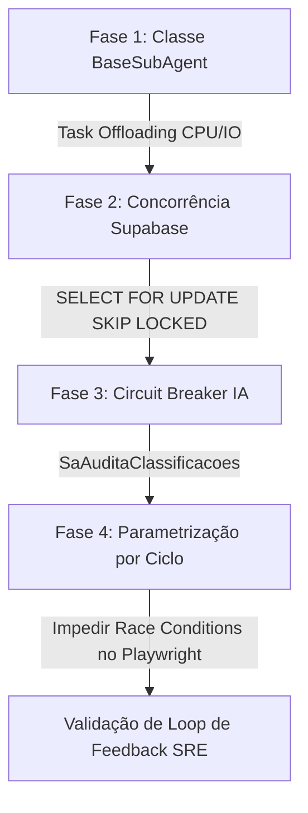

# PLANEJAMENTO DE OTIMIZAÇÃO DE SUBAGENTES (Sentinela)

Este documento detalha o plano de engenharia para otimização arquitetural, concorrência, isolamento e controle de execução dos subagentes analíticos (`SaMineracaoRedes`, `SaAuditoriaFinanceira`) e de SRE (`SaDiagnosticaSistemas`, `WkAplicaSugestoes`, `SaAuditaClassificacoes`).

---

## 📋 Objetivos do Design
1. **Isolamento de CPU-bound**: Impedir que processos pesados de grafos (Pandas/NetworkX) bloqueiem o loop de eventos assíncrono do processador de inteligência.
2. **Concorrência Horizontal**: Garantir que a escala de múltiplos subagentes ocorra sem concorrência de lote (usando `SKIP LOCKED`).
3. **Impedimento de Condições de Corrida**: Garantir que as alterações de SRE nas configurações de workers só entrem em vigor no boot do ciclo operacional, não durante a execução.

---

## 🛠️ Passo a Passo de Implementação



### 1. ⚙️ Fase 1: Desenho da Classe `BaseSubAgent` (CPU-bound vs I/O-bound)
Para implementar a execução efêmera sem bloquear a thread principal do loop do `asyncio`, criamos a abstração `BaseSubAgent`.

*   **Padrão de Execução**:
    *   **CPU-bound (Computação pesada / Pandas / Grafos)**: Executados via `ProcessPoolExecutor` para tirar vantagem de múltiplos cores e evitar o bloqueio da thread principal.
    *   **I/O-bound (Consultas SQL lentas / APIs)**: Executados via `asyncio.to_thread()` ou pools de thread para delegar sem bloquear o loop de eventos.
*   **Ciclo de Vida Efêmero**: O subagente inicializa, executa a tarefa específica, persiste o resultado no Supabase e se encerra (evitando memory leaks das instâncias do Pandas/NetworkX na RAM do processo principal).

#### Exemplo de Estrutura da Classe Base:
```python
# workers/base/subagent_base.py
import asyncio
from abc import ABC, abstractmethod
from concurrent.futures import ProcessPoolExecutor
from workers.base.worker_base import BaseWorker

class BaseSubAgent(BaseWorker, ABC):
    """
    Base para subagentes analíticos efêmeros.
    Suporta delegação de CPU-bound para pool de processos e I/O-bound para threads.
    """
    
    def __init__(self, worker_id: str, config: dict):
        super().__init__(worker_id, config)
        self._executor = ProcessPoolExecutor(max_workers=2)

    async def run_cpu_bound(self, fn, *args):
        """Delega processamento CPU-bound para pool de processos."""
        loop = asyncio.get_running_loop()
        return await loop.run_in_executor(self._executor, fn, *args)

    async def run_io_bound(self, fn, *args):
        """Delega processamento I/O-bound bloqueante para thread."""
        return await asyncio.to_thread(fn, *args)

    def shutdown(self):
        self._executor.shutdown(wait=True)
```

---

### 2. 🔀 Fase 2: Concorrência Horizontal via Supabase (SKIP LOCKED)
Para evitar que múltiplos subagentes analíticos (escalados horizontalmente em pods ou réplicas separadas) concorram no processamento do mesmo lote de dados:

*   **Ponteiros de Contexto**: O `EventBus` trafegará apenas IDs/ponteiros de lote (Ex: `batch_id`). O subagente usará o ID para buscar dados no Supabase.
*   **Controle de Lote Atômico**: Criar uma tabela de orquestração analítica `lotes_analises` no Supabase com os estados: `PENDENTE`, `PROCESSANDO`, `CONCLUIDO`, `ERRO`.
*   **Query de Claim com SKIP LOCKED**:
    ```sql
    -- RPC no Supabase para reivindicação de lote analítico atômico
    CREATE OR REPLACE FUNCTION reivindicar_lote_analise(worker_name TEXT)
    RETURNS TABLE (id UUID, batch_id UUID) AS $$
    DECLARE
        lote_id UUID;
    BEGIN
        SELECT la.id INTO lote_id
        FROM lotes_analises la
        WHERE la.status = 'PENDENTE'
        ORDER BY la.created_at ASC
        FOR UPDATE SKIP LOCKED
        LIMIT 1;

        IF lote_id IS NOT NULL THEN
            UPDATE lotes_analises
            SET status = 'PROCESSANDO',
                processado_por = worker_name,
                updated_at = TIMEZONE('utc', NOW())
            WHERE id = lote_id;
            
            RETURN QUERY SELECT la.id, la.batch_id FROM lotes_analises la WHERE la.id = lote_id;
        END IF;
    END;
    $$ LANGUAGE plpgsql;
    ```

---

### 3. 🛡️ Fase 3: Roteamento de IA, Circuit Breaker e SaAuditaClassificacoes
A calibração do detector de drift do `SaAuditaClassificacoes` exige coordenação resiliente e anti-alucinação.

*   **Cascade + Circuit Breaker**: O `SaAuditaClassificacoes` utilizará a mesma cascata resiliente de provedores gerenciada por `core/ai_service.py` (Ollama -> Groq -> OpenRouter -> Mistral).
*   **Circuit Breaker Local**: Caso o provedor prioritário de auditoria (ex: Groq) sofra falhas ou cota de taxa limite (429), ele é suspenso por 60 segundos, caindo para o provedor secundário (ex: Mistral ou Ollama local).
*   **Medição de Drift**: Comparação léxica e estatística entre a classificação de produção e a de auditoria. Se a taxa de discrepância for superior a 20%, o subagente cria um registro do tipo `drift_detected` na tabela `worker_suggestions` com prioridade `HIGH`.

---

### 4. 🔄 Fase 4: Parametrização por Ciclo (Anti-Race Condition SRE)
Para evitar corrupção de estado ou travamento nas sessões ativas do Playwright nos scrapers durante mudanças dinâmicas de configuração sugeridas pelo SRE (`WkAplicaSugestoes`):

*   **Padrão de Configuração Imutável**:
    *   O scraper (`WkColetaInstagram`) carrega a configuração no boot do ciclo (`run_cycle`).
    *   A configuração carregada (ex: `max_posts`, `jitter`, `max_comments`) é copiada para o contexto local da thread/ciclo (imutável durante a requisição).
    *   Caso `WkAplicaSugestoes` atualize os parâmetros de configuração do scraper no meio da execução, a mudança será gravada nas tabelas de metadados operacionais e no estado geral do orquestrador, mas só afetará a instância do worker no **início do próximo ciclo** (após o período de cooldown de 10-30 minutos).
