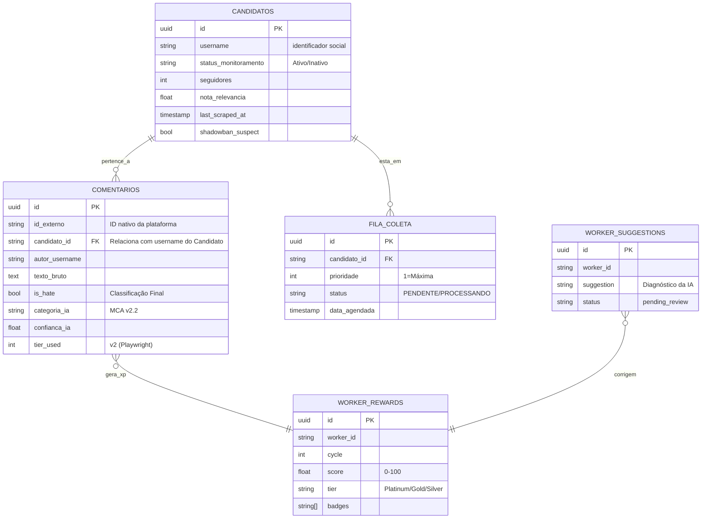

# ESQUEMA DE DADOS - SENTINELA (v58.0)
_Data de mapeamento: 24 de Maio de 2026_

## 🗺️ Visão Geral da Arquitetura
O banco de dados do Sentinela (Supabase/PostgreSQL) segue um modelo **Relacional Centralizado** com foco em integridade forense e auditabilidade.

### Diagrama de Relacionamentos (Mermaid)

---

## 📑 Detalhamento por Tabela

### 1. `candidatos`
Base de dados dos perfis monitorados.
- **id**: UUID (PK)
- **username**: Nome de usuário (ex: `@raquellyraoficial`)
- **cargo / estado / partido**: Metadados políticos.
- **seguidores**: Inteiro para cálculo de alcance.
- **last_scraped_at**: Controle de fluxo de coleta.
- **shadowban_suspect**: Flag de integridade do perfil.

### 2. `comentarios`
Repositório central de inteligência capturada.
- **id_externo**: ID original do Instagram (Idempotência).
- **candidato_id**: Username do alvo (Foreign Key virtual).
- **texto_bruto**: Conteúdo sem filtros.
- **is_hate**: Resultado booleano da classificação de IA.
- **categoria_ia**: Classificação técnica via MCA v2.2.
- **confianca_ia**: Score de precisão da IA (0.0 a 1.0).
- **tier_used**: 2 (Playwright) | 1 (GraphQL).

### 3. `fila_coleta`
Lógica de despacho dinâmico.
- **prioridade**: Inteiro (1=Máxima, 5=Baixa).
- **status**: PENDENTE, PROCESSANDO, CONCLUÍDO.
- **data_agendada**: Data/Hora prevista para próxima coleta.

### 4. `worker_rewards`
Log de performance e reputação dos agentes.
- **worker_id**: Identificador do robô (ex: `ig-v2-01`).
- **score**: Reputação acumulada (0-100).
- **tier**: Platinum, Gold, Silver, Bronze, Critical.
- **badges**: Conquistas operacionais (JSON List).

### 5. `worker_suggestions`
Diagnósticos gerados pelo AIAdvisor.
- **suggestion**: Texto técnico de correção sugerida pela IA.
- **status**: pending_review | applied | rejected.

---

## 🔗 Ponto de Integração Frontend
Para o desenvolvimento do novo frontend, os endpoints REST do Supabase devem ser consumidos seguindo este esquema para garantir a correta visualização da "Saúde do Sistema" e do "Risco Forense".
