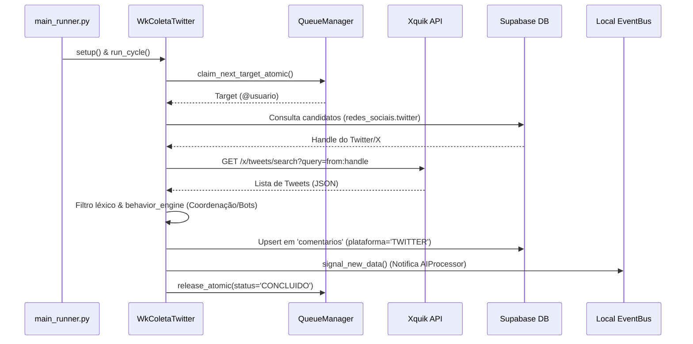

# WkColetaTwitter — Coleta de Postagens do Twitter/X
_version: 98.5 | last_updated: 2026-06-29 | status: Ativo em Produção_

## 1. Visão Geral

**WkColetaTwitter** é o worker especializado na coleta de dados da rede social X (Twitter) para o ecossistema Sentinela. Ele utiliza a API de dados da plataforma **Xquik** para consultar e extrair publicações recentes de candidatos cadastrados na fila de monitoramento, alimentando o pipeline de inteligência e análise de discurso.

### Informações Básicas
- **ID do Worker**: Dinâmico (e.g., `twitter-01`)
- **Localização**: `workers/scrapers/wk_coleta_twitter.py`
- **Classe**: `WkColetaTwitter` (herda de `BaseWorker`)
- **Status**: 🟢 Ativo em produção
- **Frequência**: Gerenciado de forma concorrente pelo orquestrador em ciclos de monitoramento.

---

## 2. Responsabilidades

| Responsabilidade | Descrição |
|---|---|
| **Consumo de Alvos** | Reivindica alvos (candidatos) de forma atômica no banco usando lock concorrente. |
| **Consulta à API Xquik** | Realiza buscas de tweets usando o operador `from:usuario` no endpoint `/x/tweets/search`. |
| **Normalização do Schema** | Transforma a estrutura dos tweets recebidos para o formato unificado de `comentarios` do banco Supabase. |
| **Processamento Léxico** | Aplica a filtragem léxica inicial de termos tóxicos locais. |
| **Detecção de Anomalias/Bots** | Passa as mensagens coletadas pelo `behavior_engine` para detectar campanhas coordenadas. |
| **Persistência de Dados** | Salva as publicações localmente no buffer e realiza upserts no Supabase com proteção RLS. |
| **Reatividade** | Dispara notificações no `local_bus` para acordar instantaneamente os classificadores. |

---

## 3. Fluxo de Execução e Chamadas de API



---

## 4. Requisitos e Variáveis de Ambiente

### `XQUIK_API_KEY` ⭐ **OBRIGATÓRIO**
- **Descrição**: Chave de API gerada a partir do painel de controle do Xquik (xquik.com).
- **Configuração no .env**:
  ```bash
  XQUIK_API_KEY=xq_sua_chave_aqui
  ```
- **Comportamento de Falha**: Se a variável não estiver presente no ambiente, o worker registrará um aviso de erro crítico no log, desativando-se de forma graciosa sem quebrar a execução geral do orquestrador.

---

## 5. Circuit Breaker e Resiliência
* **Integração**: Utiliza a chave `"twitter"` no `scraper_circuit_breaker` global.
* **Comportamento**: Se a API do Xquik retornar erros de autenticação (401/403), rate limit (429) ou erros de infraestrutura devidos consecutivos, o disjuntor de rede se abrirá para o Twitter. A coleta desta plataforma será pausada temporariamente para evitar consumo de tokens de erro, restabelecendo-se em modo `HALF_OPEN` para testes de integridade após o cooldown exponencial.

---

## 6. Monitoramento e Logs

### Logs no terminal / Rotating Files
```bash
# Monitorar atividades do worker
tail -f logs/main_runner.json | grep "worker.twitter"
```

---

## 7. Dependências

- `workers/base/worker_base.py` — Classe base do worker.
- `workers/base/cycle_result.py` — Estrutura padronizada de fim de ciclo.
- `core/supabase_service.py` — Cliente Supabase.
- `core/local_buffer.py` — Persistência em buffer local.
- `core/lexical_filter.py` — Triagem inicial local.
- `core/event_bus.py` — EventBus local para sinalização assíncrona.
- `core/circuit_breaker.py` — Disjuntor para tratamento de rate limits e timeouts.
- `httpx` — Cliente assíncrono para chamadas HTTP REST.

---

## 8. Changelog

### v98.5 (2026-06-29)
- [x] Criação do worker `WkColetaTwitter`.
- [x] Integração nativa com a API REST do Xquik.
- [x] Registro na malha de scrapers leves no `main_runner.py`.
- [x] Mapeamento com a tabela `comentarios` do Supabase.

---

**Última Revisão**: 2026-06-29
**PASA Version**: v98.4 → v98.5
